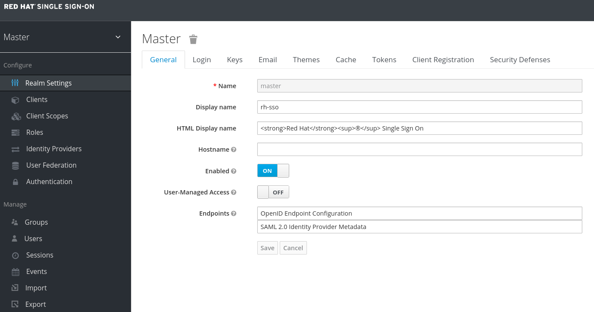
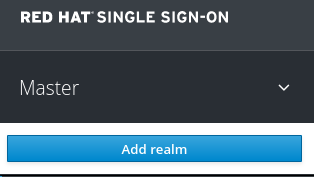
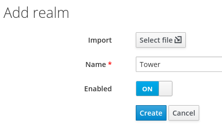
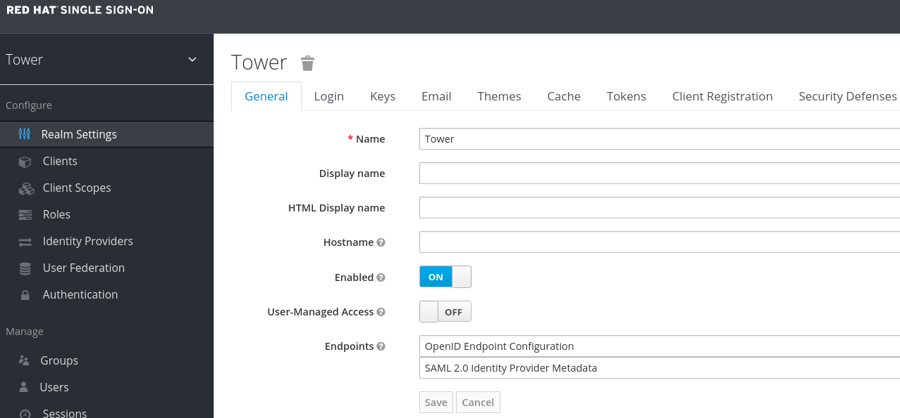

# AAP-SSO

## CONFIGURE RED HAT SSO

```
echo "# AAP-SSO" >> README.md
git init
git add README.md
git commit -m "first commit"
git branch -M main
git remote add origin https://github.com/alpha-wolf-jin/AAP-SSO.git
git config --global credential.helper 'cache --timeout 72000'
git push -u origin main

git add . ; git commit -a -m "update README" ; git push -u origin main
```


## Start RED HAT SSO in container

```
[root@aap-eda ~]# podman login  registry.redhat.io
Username: 
Password: 
Login Succeeded!
[root@aap-eda ~]# podman run --detach \
>     -e VIRTUAL_HOST=sso.int.shifti.us \
>     -e VIRTUAL_PROTO=http \
>     -e VIRTUAL_PORT=8080 \
>     -e SSO_HOSTNAME=sso.int.shifti.us \
>     -e SSO_ADMIN_USERNAME=admin \
>     -e SSO_ADMIN_PASSWORD=admin \
>     --hostname sso.int.shifti.us \
>     --publish 8080:8080 \
>     --name rhsso \
>     --restart always \
>     registry.redhat.io/rh-sso-7/sso74-openshift-rhel8
```


## CONFIGURE RED HAT SSO

http://sso.int.shifti.us:8080/auth/admin

You’ll land in the Master realm by default.


Click the **Master** realm name on top left  


click the **Add Realm** buttom from the dropdown menu
Type your new realm name (e.g. “Tower”) and click the **Create** button



Once created, you’ll land in the Tower realm



```
[root@aap-eda ~]# openssl req -new -x509 -days 3650 -nodes -out tower.crt -keyout tower.key
Generating a RSA private key
.........................................................................+++++
....................+++++
writing new private key to 'tower.key'
-----
You are about to be asked to enter information that will be incorporated
into your certificate request.
What you are about to enter is what is called a Distinguished Name or a DN.
There are quite a few fields but you can leave some blank
For some fields there will be a default value,
If you enter '.', the field will be left blank.
-----
Country Name (2 letter code) [XX]:SG
State or Province Name (full name) []:SG
Locality Name (eg, city) [Default City]:Singapore    
Organization Name (eg, company) [Default Company Ltd]:Auto
Organizational Unit Name (eg, section) []:Auto
Common Name (eg, your name or your server's hostname) []:aap-eda.example.com
Email Address []:root@localhost
```


```
[root@aap-eda ~]# openssl x509 -in /etc/tower/tower.cert -text -noout
Certificate:
    Data:
        Version: 3 (0x2)
        Serial Number:
            33:98:82:84:74:5c:f8:78:70:9e:55:48:cb:ef:7d:7b:7d:9f:e1:e7
        Signature Algorithm: sha256WithRSAEncryption
        Issuer: C = US, O = Ansible Automation Platform by Red Hat, CN = Ansible Automation Platform
        Validity
            Not Before: Jun 28 06:52:15 2023 GMT
            Not After : Jun 28 06:52:15 2024 GMT
        Subject: CN = aap-eda.example.com

[root@aap-eda ~]# openssl x509 -noout -modulus -in /etc/tower/tower.cert | openssl md5
(stdin)= 74dee091c4a4a7009d2295f6b4d5a952
[root@aap-eda ~]# openssl rsa -noout -modulus -in /etc/tower/tower.key | openssl md5
(stdin)= 74dee091c4a4a7009d2295f6b4d5a952
```

```
$ openssl req -new -x509 -days 3650 -nodes -out saml.crt -keyout saml.key
Generating a RSA private key
.......+++++
..................................+++++
writing new private key to 'saml.key'
-----
You are about to be asked to enter information that will be incorporated
into your certificate request.
What you are about to enter is what is called a Distinguished Name or a DN.
There are quite a few fields but you can leave some blank
For some fields there will be a default value,
If you enter '.', the field will be left blank.
-----
Country Name (2 letter code) [XX]:SG
State or Province Name (full name) []:SG
Locality Name (eg, city) [Default City]:Singapore
Organization Name (eg, company) [Default Company Ltd]:Red Hat
Organizational Unit Name (eg, section) []:GPS
Common Name (eg, your name or your server's hostname) []:sso.int.shifti.us
Email Address []:root@localhost
```

https://www.ansible.com/blog/red-hat-single-sign-on-integration-with-ansible-tower

https://liveaverage.com/blog/configure-ansible-tower-saml-authentication-with-keycloak/

https://www.insentragroup.com/us/insights/geek-speak/modern-workplace/how-to-configure-ansible-automation-saml-sso-with-red-hat-sso/

https://docs.ansible.com/automation-controller/latest/html/userguide/job_templates.html#ug-jt-enable-webhooks
